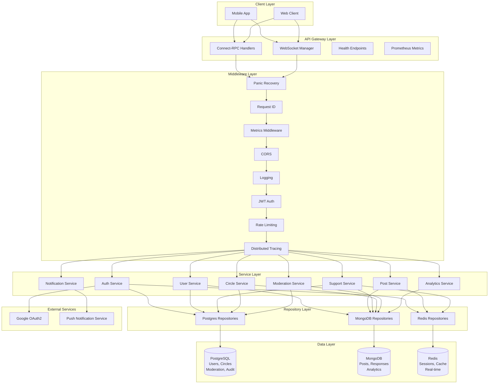

# Anonymous Support Backend

[](https://github.com/sandeepkv93/anonymous-support-backend/actions)
[](https://go.dev/)
[](LICENSE)

A production-ready backend system for an anonymous peer support mobile application where users can post real-time struggles with addictions/cravings and receive immediate community support.

## About

This backend powers a peer support platform designed to help individuals struggling with addictions, cravings, and recovery challenges by connecting them with a supportive community in real-time.

### The Problem

Traditional support systems often have significant barriers:
- Scheduled meetings that don't align with moments of crisis
- Geographic limitations requiring physical attendance
- Fear of judgment or stigma preventing people from seeking help
- Lack of immediate support when cravings or triggers hit
- Limited community access outside of formal programs

### The Solution

Anonymous Support provides:
- **Instant Access**: Post SOS alerts when facing a craving or difficult moment and receive immediate community support
- **Anonymous by Default**: Users can participate without revealing their identity, reducing stigma and encouraging honest sharing
- **24/7 Community**: Global peer support available anytime, anywhere
- **Structured Support Types**: Different post categories (SOS, check-ins, victories, questions) for various support needs
- **Topic-Specific Circles**: Join communities focused on specific addictions, challenges, or recovery approaches
- **Gamification for Good**: Strength points reward helpful participation, encouraging active community engagement

### How It Works

**For Someone Seeking Support:**
1. Register anonymously (username + avatar) or with email for account recovery
2. Post an SOS alert when facing a craving: "Really struggling right now, been 30 days clean but the urge is intense"
3. Receive immediate responses from community members who understand the struggle
4. Get one-tap quick support (e.g., "You got this!", "Stay strong!") and detailed text/voice responses
5. Track recovery progress with streak counters and analytics
6. Celebrate victories by posting milestones to inspire others

**For Community Members:**
1. Browse real-time feed of posts from people needing support
2. Respond with encouragement, advice, or shared experiences
3. Earn strength points for helping others, building reputation in the community
4. Join topic-specific circles (alcohol recovery, smoking cessation, gambling addiction, etc.)
5. Filter feed by urgency level to focus on critical needs first

**For Moderators:**
1. Review flagged content through moderation queue
2. Take action on harmful content or harassment
3. Access audit logs for security and compliance
4. Manage circles and community guidelines

### Key Features

**Post Types:**
- **SOS Alerts**: Urgent help needed during moments of crisis or intense cravings
- **Check-ins**: Daily or regular status updates on recovery journey
- **Victories**: Celebrating milestones (1 day clean, 30 days, 1 year, etc.)
- **Questions**: Seeking advice or information from the community

**Support Mechanisms:**
- **Quick Support Buttons**: One-tap encouragement for instant validation
- **Text Responses**: Detailed advice, shared experiences, and empathy
- **Voice Notes**: Personal voice messages for deeper connection (planned)
- **Real-time Notifications**: Instant alerts when your post receives support

**Community Organization:**
- **Support Circles**: Topic-specific communities (e.g., "Alcohol Recovery", "Nicotine Freedom", "Clean & Sober")
- **Public/Private Circles**: Choose visibility level based on sensitivity
- **Member Roles**: Regular members, moderators, and administrators

**Safety & Moderation:**
- **Content Filtering**: Automatic detection of harmful content, profanity, and triggers
- **User Blocking**: Block users who are not supportive or violate guidelines
- **Reporting System**: Flag inappropriate content for moderator review
- **Audit Trail**: Complete history of moderation actions for accountability

**Privacy & Security:**
- **Anonymous First**: No requirement to reveal real identity
- **Encrypted Data**: AES-256 encryption for sensitive information
- **Secure Authentication**: JWT tokens with rotation and OAuth2 support
- **Soft Delete**: Recovery option for accidentally deleted content

### Use Cases

1. **Crisis Intervention**: User feeling overwhelming craving posts SOS, receives immediate community support to help resist
2. **Daily Accountability**: Users post check-ins to maintain streak and stay accountable to community
3. **Milestone Celebration**: Someone reaches 90 days sober, posts victory to inspire and be celebrated by community
4. **Knowledge Sharing**: New member asks about coping strategies, experienced members share what worked for them
5. **Trigger Management**: User identifies a trigger situation, community helps develop coping plan
6. **Relapse Support**: After a setback, user finds non-judgmental encouragement to restart journey

### Target Audience

- Individuals in recovery from addiction (alcohol, drugs, nicotine, gambling, etc.)
- People experiencing cravings and seeking immediate peer support
- Support groups looking for digital-first community platforms
- Recovery programs wanting to supplement in-person meetings with 24/7 online support
- Healthcare providers seeking tools to connect patients with peer communities

## Production-Ready Features

- **Proper Dependency Injection**: Interface-based design with compile-time checks across all layers
- Connect-RPC API with full service implementation
- Comprehensive configuration validation
- Structured logging with request correlation IDs
- Advanced health checks (liveness, readiness, dependency status)
- Prometheus metrics endpoint
- Panic recovery with stack traces
- Database connection pooling (Postgres, MongoDB, Redis)
- JWT hardening (issuer, audience, not-before validation)
- RBAC authorization system
- OAuth2 authentication (Google Sign-In)
- Audit logging for security events
- Distributed tracing support
- CI/CD pipeline (GitHub Actions)
- Kubernetes deployment manifests
- Production-grade middleware stack
- Soft delete functionality
- Token rotation for enhanced security
- Retry mechanisms with exponential backoff
- Secrets management
- Push notifications support

## Features

**Authentication & Authorization**
- Anonymous user registration
- Email-based authentication
- OAuth2/Google Sign-In integration
- JWT token management with rotation
- Role-based access control (RBAC)

**Real-time Communication**
- WebSocket-based real-time updates for posts and responses
- Live feed synchronization
- Real-time notifications

**Support System**
- Support Circles: Create and join topic-specific support communities
- Post Types: SOS alerts, check-ins, victories, and questions
- Quick Support: One-tap support buttons for immediate encouragement
- Strength Points: Gamification to encourage helpful participation
- Voice note responses

**Content & Security**
- Content Moderation: Automatic flagging of harmful content
- User blocking system
- Content reporting
- Audit logging for security events
- Soft delete for data recovery

**Analytics & Tracking**
- User streak tracking
- Craving resistance metrics
- Recovery progress analytics
- Support statistics

**Infrastructure**
- Rate limiting to prevent spam and abuse
- Encrypted sensitive data (AES-256)
- MongoDB migrations framework
- Database transaction support
- Distributed caching
- Seed data for development

## Architecture



### Architecture Highlights

**Dependency Injection**
- **Interface-Based Design**: All services depend on repository interfaces, all handlers depend on service interfaces
- **Constructor Injection**: Dependencies injected via constructors for clarity and testability
- **Compile-Time Safety**: Interface implementation checks ensure type safety at compile time
- **Zero Type Assertions**: Clean dependency wiring without runtime type assertions
- **Testability**: Easy mocking and unit testing through interface boundaries

**Layer Separation**
- **Handlers**: Accept service interfaces, handle HTTP/RPC protocol concerns
- **Services**: Depend on repository interfaces, contain business logic
- **Repositories**: Implement data access interfaces, isolated per database
- **Clean Boundaries**: No concrete type leakage across layers

**Benefits**
- Swappable implementations (e.g., PostgreSQL → MySQL)
- Isolated unit testing with mocks
- Clear dependency graph
- Maintainable and scalable codebase

## Tech Stack

- **Language**: Go 1.24+
- **API Framework**: Connect-RPC (type-safe gRPC alternative with HTTP/2)
- **Real-time**: WebSockets (gorilla/websocket)
- **Databases**:
  - PostgreSQL 16+ (users, circles, moderation, audit logs)
  - MongoDB 7+ (posts, responses, analytics)
  - Redis 7+ (sessions, real-time, caching)
- **Authentication**: JWT tokens, OAuth2 (Google)
- **Observability**: Zap (logging), Prometheus (metrics), OpenTelemetry (tracing)
- **Configuration**: Viper
- **Migrations**: golang-migrate

## Prerequisites

- Go 1.24 or higher
- [Task](https://taskfile.dev/) - Task runner (install: `go install github.com/go-task/task/v3/cmd/task@latest`)
- Docker & Docker Compose
- PostgreSQL 16
- MongoDB 7
- Redis 7

## Quick Start

### 1. Clone the Repository

```bash
git clone https://github.com/sandeepkv93/anonymous-support-backend.git
cd anonymous-support-backend
```

### 2. Run Setup Script

```bash
./scripts/setup.sh
```

This will:
- Create `.env` file from template
- Install required tools (buf, migrate)
- Start infrastructure services (Postgres, MongoDB, Redis)
- Run database migrations
- Initialize MongoDB collections

### 3. Start the Application

**Option A: Run locally**

```bash
task run
```

**Option B: Run with Docker**

```bash
task docker-compose-up
```

**Option C: Run with seed data**

```bash
task seed
task run
```

**Option D: Run with hot reload (development)**

```bash
task dev
```

The server will start on `http://localhost:8080`

## Available Commands

Use `task --list` to see all available commands. Here are the most commonly used:

**Development**
```bash
task                      # Show available tasks
task install              # Install development dependencies
task run                  # Build and run the application
task dev                  # Run with hot reload (air)
task build                # Build the application binary
task clean                # Clean build artifacts and caches
```

**Code Quality**
```bash
task test                 # Run all tests with race detection
task test-unit            # Run unit tests only
task test-integration     # Run integration tests
task test-coverage        # Generate coverage report (HTML)
task lint                 # Run linters (gofmt, go vet, golangci-lint)
task lint-fix             # Auto-fix linting issues
task fmt                  # Format code and tidy modules
task security             # Run security vulnerability scans
```

**Database**
```bash
task migrate-up           # Run database migrations
task migrate-down         # Rollback last migration
task migrate-create       # Create new migration (usage: task migrate-create -- migration_name)
task seed                 # Seed database with test data
```

**Protobuf**
```bash
task proto                # Generate code from proto files
```

**Docker**
```bash
task docker-compose-up    # Start all services with docker-compose
task docker-compose-down  # Stop all services
task docker-compose-logs  # View logs from services
task docker-build         # Build Docker image
task docker-run           # Run Docker container
```

**Kubernetes**
```bash
task k8s-apply            # Apply Kubernetes manifests
task k8s-delete           # Delete Kubernetes resources
```

**Utilities**
```bash
task deps                 # Update dependencies
task verify               # Run all checks (fmt, lint, test, build)
task gen-mocks            # Generate mock implementations
```

## Database Migrations

### PostgreSQL Migrations

Migrations are in `migrations/postgres/`:

- `001_create_users` - User accounts and authentication
- `002_create_circles` - Support circles
- `003_create_memberships` - Circle memberships
- `004_create_blocks` - User blocking system
- `005_create_reports` - Content reporting
- `006_create_audit_logs` - Security audit trail
- `007_add_soft_delete` - Soft delete support for users, circles, and reports

### MongoDB Collections

MongoDB collections are initialized via `migrations/mongodb/init.js` and programmatic migrations in `internal/pkg/migrations/`:
- `posts` - User posts (SOS, check-ins, victories, questions)
- `responses` - Support responses and quick support
- `analytics` - User analytics and streak tracking

## API Endpoints

### REST Endpoints

- `GET /health` - Full dependency health check (Postgres, MongoDB, Redis)
- `GET /health/ready` - Readiness probe for Kubernetes
- `GET /health/live` - Liveness probe for Kubernetes
- `GET /metrics` - Prometheus metrics endpoint
- `WS /ws` - WebSocket connection (requires authentication)

### Connect-RPC Services

All RPC services use Connect-RPC protocol and are available at `/[package].[version].[Service]/[Method]`

#### AuthService (`/auth.v1.AuthService/`)

- `RegisterAnonymous` - Register anonymous user with username
- `RegisterWithEmail` - Register user with email and password
- `Login` - Authenticate user with username/password
- `RefreshToken` - Refresh access token
- `Logout` - Invalidate user session

#### UserService (`/user.v1.UserService/`)

- `GetProfile` - Retrieve user profile
- `UpdateProfile` - Update username or avatar
- `GetStreak` - Get user streak and craving statistics
- `UpdateStreak` - Update streak after relapse

#### PostService (`/post.v1.PostService/`)

- `CreatePost` - Create new post (SOS, check-in, victory, question)
- `GetPost` - Retrieve post by ID
- `GetFeed` - Get personalized feed with filters
- `DeletePost` - Soft delete post
- `UpdatePostUrgency` - Update urgency level

#### SupportService (`/support.v1.SupportService/`)

- `CreateResponse` - Add text/quick/voice response to post
- `GetResponses` - Retrieve responses for a post
- `QuickSupport` - Send quick support button tap
- `GetSupportStats` - Get user support statistics

#### CircleService (`/circle.v1.CircleService/`)

- `CreateCircle` - Create new support circle
- `JoinCircle` - Join existing circle
- `LeaveCircle` - Leave circle
- `GetCircleMembers` - List circle members
- `GetCircleFeed` - Get circle-specific feed
- `GetCircles` - Browse available circles

#### ModerationService (`/moderation.v1.ModerationService/`)

- `ReportContent` - Report post or response
- `GetReports` - List moderation reports (admin)
- `ModerateContent` - Take action on report (admin)

## Authentication

The API uses JWT bearer tokens:

```
Authorization: Bearer <access_token>
```

**Token Lifecycle:**
- Access tokens expire in 15 minutes
- Refresh tokens expire in 7 days
- Sessions are stored in Redis
- Token rotation on refresh for enhanced security

**OAuth2 Flow:**
- Google Sign-In supported
- PKCE (Proof Key for Code Exchange) implementation
- Automatic user creation on first OAuth login

## Configuration

Configuration is managed via environment variables. Copy `.env.example` to `.env` and customize:

```bash
# Server
SERVER_PORT=8080
SERVER_ENV=development

# PostgreSQL
POSTGRES_HOST=localhost
POSTGRES_PORT=5432
POSTGRES_USER=support_user
POSTGRES_PASSWORD=support_pass
POSTGRES_DB=support_db
POSTGRES_SSL_MODE=disable

# MongoDB
MONGODB_URI=mongodb://localhost:27017
MONGODB_DB=support_db

# Redis
REDIS_HOST=localhost
REDIS_PORT=6379
REDIS_PASSWORD=
REDIS_DB=0

# JWT
JWT_SECRET=your-super-secret-key-change-in-production
JWT_ACCESS_EXPIRY=15m
JWT_REFRESH_EXPIRY=168h

# Encryption (must be exactly 32 bytes for AES-256)
ENCRYPTION_KEY=32-byte-encryption-key-for-aes-256-change-this-in-production

# Rate Limiting
RATE_LIMIT_POSTS_PER_HOUR=10
RATE_LIMIT_RESPONSES_PER_HOUR=100

# WebSocket
WS_READ_BUFFER_SIZE=1024
WS_WRITE_BUFFER_SIZE=1024
WS_MAX_MESSAGE_SIZE=8192

# Moderation
ENABLE_AUTO_MODERATION=true
PROFANITY_FILTER_LEVEL=strict

# Timeouts
SERVER_READ_TIMEOUT=15s
SERVER_WRITE_TIMEOUT=15s
SERVER_IDLE_TIMEOUT=60s
DB_TIMEOUT=10s
HTTP_TIMEOUT=30s
CONTEXT_TIMEOUT=30s

# OAuth2 (optional)
GOOGLE_CLIENT_ID=your-google-client-id
GOOGLE_CLIENT_SECRET=your-google-client-secret
GOOGLE_REDIRECT_URL=http://localhost:8080/auth/google/callback

# Tracing (optional)
ENABLE_TRACING=false
JAEGER_ENDPOINT=http://localhost:14268/api/traces

# Notifications (optional)
ENABLE_PUSH_NOTIFICATIONS=false
FCM_SERVER_KEY=your-fcm-server-key
```

## Project Structure

```
anonymous-support-backend/
├── cmd/
│   └── server/              # Application entry point
├── internal/
│   ├── app/                 # Application bootstrap and lifecycle
│   ├── config/              # Configuration management
│   ├── domain/              # Domain models
│   │   ├── user.go
│   │   ├── post.go
│   │   ├── support.go
│   │   ├── circle.go
│   │   ├── moderation.go
│   │   └── audit.go
│   ├── dto/                 # Data transfer objects
│   ├── errors/              # Custom error types
│   ├── repository/          # Data access layer (interface-based)
│   │   ├── interfaces.go    # Repository interfaces (10 interfaces)
│   │   ├── postgres/        # PostgreSQL repositories (User, Circle, Moderation, Audit)
│   │   ├── mongodb/         # MongoDB repositories (Post, Support, Analytics)
│   │   └── redis/           # Redis repositories (Session, Realtime, Cache)
│   ├── service/             # Business logic (interface-based)
│   │   ├── interfaces.go    # Service interfaces (7 interfaces)
│   │   ├── auth_service.go
│   │   ├── user_service.go
│   │   ├── post_service.go
│   │   ├── support_service.go
│   │   ├── circle_service.go
│   │   ├── moderation_service.go
│   │   ├── analytics_service.go
│   │   └── notification_service.go
│   ├── handler/             # HTTP/WebSocket handlers
│   │   ├── rpc/             # Connect-RPC handlers
│   │   ├── websocket/       # WebSocket handlers
│   │   └── health.go        # Health check handler
│   ├── middleware/          # HTTP middleware
│   │   ├── auth.go
│   │   ├── logging.go
│   │   ├── cors.go
│   │   ├── metrics.go
│   │   ├── recovery.go
│   │   ├── request_id.go
│   │   ├── tracing.go
│   │   ├── ratelimit.go
│   │   └── chain.go
│   └── pkg/                 # Shared utilities
│       ├── jwt/             # JWT token management
│       ├── encryption/      # AES-256 encryption
│       ├── validator/       # Input validation
│       ├── moderator/       # Content moderation
│       ├── authz/           # Authorization (RBAC)
│       ├── metrics/         # Prometheus metrics
│       ├── tracing/         # Distributed tracing
│       ├── oauth2/          # OAuth2 providers
│       ├── retry/           # Retry mechanisms
│       ├── cache/           # Cache abstraction
│       ├── transaction/     # Transaction support
│       ├── secrets/         # Secrets management
│       ├── migrations/      # MongoDB migrations
│       └── notifications/   # Push notifications
├── proto/                   # Protocol buffer definitions
│   ├── auth/v1/
│   ├── user/v1/
│   ├── post/v1/
│   ├── support/v1/
│   ├── circle/v1/
│   └── moderation/v1/
├── gen/                     # Generated code from proto files
├── migrations/              # Database migrations
│   ├── postgres/            # PostgreSQL migrations
│   └── mongodb/             # MongoDB initialization
├── k8s/                     # Kubernetes manifests
│   ├── deployment.yaml
│   ├── service.yaml
│   └── hpa.yaml
├── scripts/                 # Setup and utility scripts
│   ├── setup.sh
│   ├── seed.sh
│   └── seed.go
├── tests/                   # Test files
│   └── contract/
├── docker-compose.yml       # Local development stack
├── Dockerfile
├── Taskfile.yml             # Task runner configuration
├── buf.yaml                 # Buf configuration
├── buf.gen.yaml             # Code generation config
└── README.md
```

## Testing

The application is designed for testability with interface-based dependency injection:

```bash
# Run all tests with race detection
task test

# Run unit tests only
task test-unit

# Run integration tests
task test-integration

# Generate coverage report (opens in browser)
task test-coverage

# Run specific package tests
go test -v ./internal/service/...

# Run contract tests
go test -v ./tests/contract/...
```

**Testability Features:**
- All services accept repository interfaces for easy mocking
- All handlers accept service interfaces for isolated testing
- Compile-time interface checks ensure correct implementations
- No database required for unit tests (mock repositories)
- Clear separation of concerns for focused testing

## Security Features

**Authentication & Authorization**
- Password hashing with bcrypt (cost 12)
- Email encryption using AES-256
- JWT validation with signature verification
- Token rotation on refresh
- OAuth2/PKCE for third-party authentication
- RBAC for fine-grained access control

**Content Security**
- Automatic profanity and harmful content detection
- Content reporting system
- User blocking functionality
- Audit logging for security events

**Infrastructure Security**
- Rate limiting per user and endpoint
- CORS with configurable policies
- Encrypted sensitive data at rest
- Soft delete for data recovery
- Panic recovery with stack traces
- Request correlation IDs for tracing

## Monitoring & Observability

**Structured Logging**
- Zap logger with configurable levels
- Request correlation IDs
- Contextual logging throughout application

**Health Checks**
- `/health` - Full dependency health check (Postgres, MongoDB, Redis)
- `/health/ready` - Readiness probe for Kubernetes
- `/health/live` - Liveness probe for Kubernetes

**Metrics** (Prometheus at `/metrics`)
- HTTP request metrics (total, duration, by endpoint, status code)
- Database operation metrics (queries, duration)
- WebSocket connection metrics
- Cache hit/miss ratios
- JWT token operations
- Rate limit metrics

**Distributed Tracing**
- OpenTelemetry integration
- Jaeger exporter support
- Request ID propagation
- Service-to-service tracing

**Error Tracking**
- Panic recovery middleware with stack traces
- Structured error logging
- Audit logs for security events

## Deployment

### Docker Deployment

Build and run with Docker Compose:

```bash
docker-compose up -d
```

### Kubernetes Deployment

Production-ready Kubernetes manifests are available in the `k8s/` directory:

```bash
kubectl apply -f k8s/
```

**Kubernetes Features:**
- HorizontalPodAutoscaler for auto-scaling (3-10 replicas)
- Resource limits and requests configured
- Liveness and readiness probes
- Secret management for sensitive configuration
- Service and ingress configuration
- Rolling updates with zero downtime

### Production Considerations

**Security**
1. Set secure values for environment variables:
   - `JWT_SECRET` (minimum 32 characters)
   - `ENCRYPTION_KEY` (exactly 32 bytes for AES-256)
   - Database passwords
   - OAuth2 credentials
   - Push notification keys

2. Enable HTTPS with reverse proxy (nginx, Caddy) or ingress controller

3. Configure proper CORS policies for your domain

4. Enable audit logging for compliance

**Database Management**
1. Set up automated backups for PostgreSQL and MongoDB

2. Configure read replicas for scaling

3. Implement proper backup retention policies

4. Monitor database performance and slow queries

**Monitoring & Alerting**
1. Integrate with monitoring solutions:
   - Prometheus for metrics scraping
   - Grafana for dashboards
   - Jaeger for distributed tracing
   - ELK stack for log aggregation

2. Set up alerts for:
   - High error rates
   - Database connection failures
   - High response times
   - Resource exhaustion

**Scaling**
1. Run multiple app instances behind a load balancer

2. Use Redis for cross-instance WebSocket message routing

3. Enable connection pooling for databases

4. Implement caching strategies with Redis

5. Use CDN for static assets

## Troubleshooting

### Connection Issues

```bash
# Check if services are running
docker-compose ps

# View logs
docker-compose logs -f app
docker-compose logs -f postgres
docker-compose logs -f mongodb
docker-compose logs -f redis

# Restart services
docker-compose restart
```

### Migration Issues

```bash
# Check migration status
migrate -path migrations/postgres -database "${POSTGRES_URL}" version

# Force migration version (use with caution)
migrate -path migrations/postgres -database "${POSTGRES_URL}" force <version>

# Rollback one migration
task migrate-down

# Run all migrations
task migrate-up

# Create new migration
task migrate-create -- add_new_feature
```

### WebSocket Connection Issues

```bash
# Check Redis connectivity
redis-cli -h localhost -p 6379 ping

# Monitor WebSocket connections
docker-compose logs -f app | grep -i websocket

# Check authentication
curl -H "Authorization: Bearer <token>" http://localhost:8080/health
```

## Contributing

1. Fork the repository
2. Create your feature branch (`git checkout -b feature/amazing-feature`)
3. Commit your changes (`git commit -m 'Add amazing feature'`)
4. Push to the branch (`git push origin feature/amazing-feature`)
5. Open a Pull Request

**Development Guidelines:**
- Write tests for new features
- Follow Go best practices and idioms
- Update documentation for API changes
- Run `task verify` before submitting PR (runs fmt, lint, test, build)
- Ensure all CI checks pass
- Use `task lint-fix` to auto-fix common linting issues
- Run `task security` to check for vulnerabilities

## License

This project is licensed under the MIT License - see the [LICENSE](LICENSE) file for details.

## Support

For questions and support:
- Open an issue on [GitHub](https://github.com/sandeepkv93/anonymous-support-backend/issues)
- Check the [Discussions](https://github.com/sandeepkv93/anonymous-support-backend/discussions)

## Links

- **Repository**: [github.com/sandeepkv93/anonymous-support-backend](https://github.com/sandeepkv93/anonymous-support-backend)
- **Issues**: [Report bugs or request features](https://github.com/sandeepkv93/anonymous-support-backend/issues)
- **CI/CD**: [GitHub Actions](https://github.com/sandeepkv93/anonymous-support-backend/actions)

---

Built for recovery and peer support | [View on GitHub](https://github.com/sandeepkv93/anonymous-support-backend)
