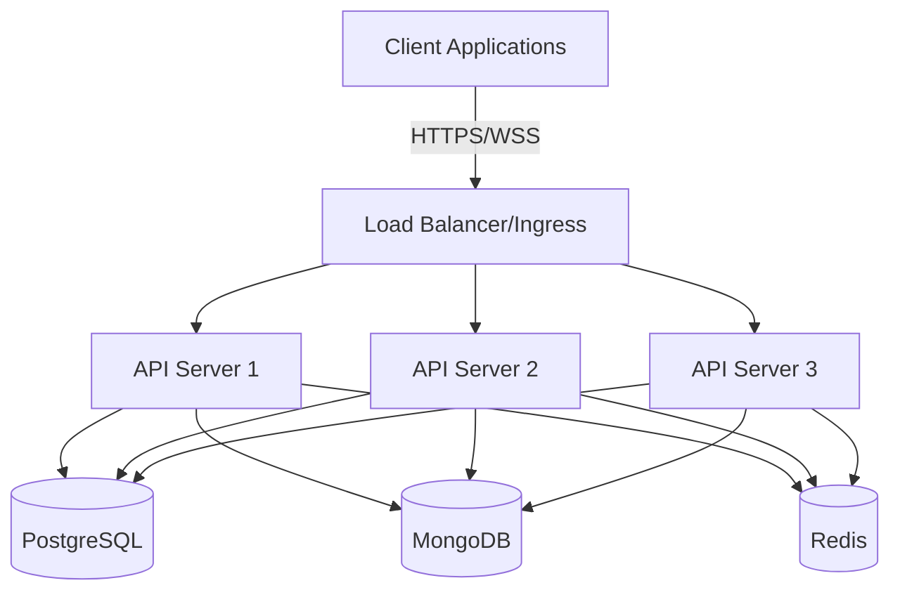
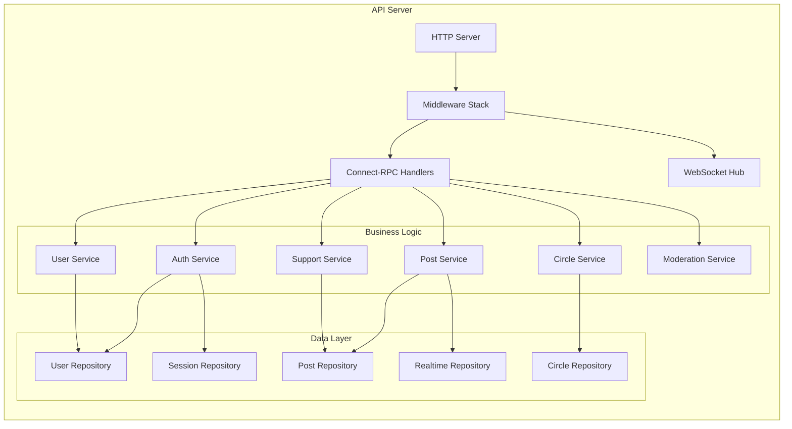
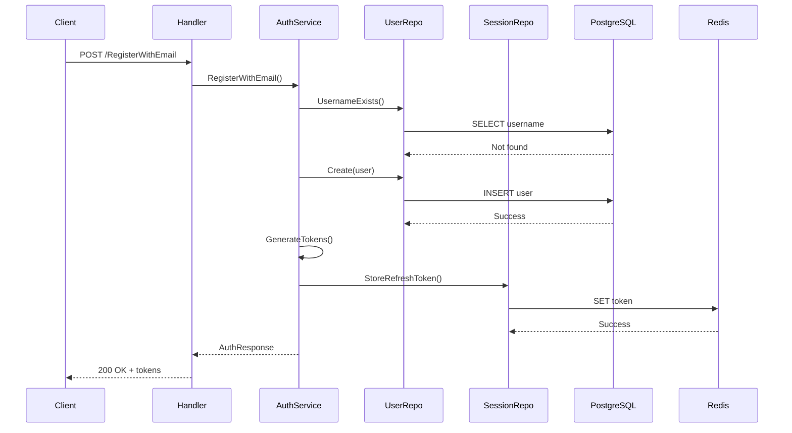
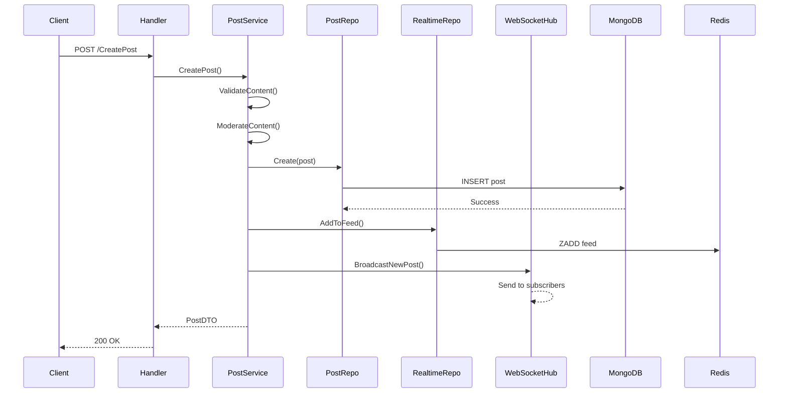
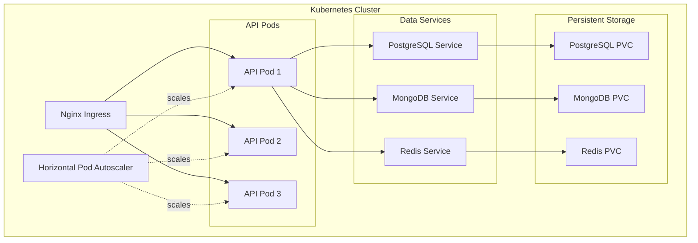

ARCHITECTURE
# Anonymous Support API - Architecture

## Overview

The Anonymous Support API is a Go-based backend service that provides support for individuals in recovery. It uses a multi-database architecture optimized for different data access patterns.

## System Architecture

## Component Architecture

## Data Flow

### User Registration Flow

### Post Creation Flow

## Database Design

### PostgreSQL Schema

Stores relational data requiring ACID guarantees:

- **users** - User accounts and authentication
- **circles** - Support communities
- **circle_memberships** - Circle membership relationships
- **reports** - Content moderation reports
- **blocks** - User blocking relationships
- **audit_logs** - Security audit trail

### MongoDB Collections

Stores document-oriented data with flexible schemas:

- **posts** - User posts with rich metadata
- **support_responses** - Support responses
- **user_trackers** - Recovery streaks and analytics
- **analytics** - User behavior metrics

### Redis Data Structures

Stores ephemeral and real-time data:

- **Sessions** - Refresh tokens (STRING with TTL)
- **User Online Status** - Active users (STRING with TTL)
- **View Counts** - Post view tracking (STRING)
- **Supporters** - Quick support tracking (SET)
- **Feeds** - Ranked feed data (SORTED SET)
- **Pub/Sub Channels** - Real-time notifications

## Technology Stack

### Core
- **Language**: Go 1.21+
- **RPC Framework**: Connect-RPC (protobuf-based)
- **WebSocket**: Gorilla WebSocket

### Data Stores
- **PostgreSQL 15**: Relational data
- **MongoDB 7**: Document data
- **Redis 7**: Cache and real-time

### Observability
- **Logging**: Zap (structured logging)
- **Metrics**: Prometheus
- **Tracing**: OpenTelemetry
- **Health Checks**: Built-in endpoints

### Security
- **Authentication**: JWT (HS256)
- **Authorization**: RBAC
- **Encryption**: AES-256 for PII
- **OAuth2**: Google Sign-In with PKCE

### Infrastructure
- **Containerization**: Docker
- **Orchestration**: Kubernetes
- **CI/CD**: GitHub Actions
- **Load Testing**: k6

## Design Patterns

### Repository Pattern
All database access is abstracted through repository interfaces, allowing for:
- Testability (mock repositories)
- Database swapping
- Consistent error handling

### Service Layer
Business logic is encapsulated in service classes that:
- Coordinate multiple repositories
- Enforce business rules
- Handle transactions

### Dependency Injection
The `internal/app` package wires all dependencies:
- Centralized composition
- Lifecycle management
- Graceful shutdown

### Error Handling
Structured errors with:
- Client-safe messages
- Internal error details in logs
- HTTP/gRPC status code mapping

## Security Architecture

### Authentication Flow
1. User provides credentials
2. Server validates and generates JWT
3. Access token (15 min) for API requests
4. Refresh token (7 days) for renewals
5. Refresh token rotation on use
6. Reuse detection triggers revocation

### Authorization
- Role-based permissions (User, Moderator, Admin)
- Resource ownership checks
- Circle membership validation
- Audit logging of security events

### Data Protection
- Passwords: bcrypt hashing
- Email: AES-256 encryption
- Tokens: Secure random generation
- TLS: Required for all connections

## Scalability Considerations

### Horizontal Scaling
- Stateless API servers
- Database connection pooling
- Redis for shared session state
- Load balancer distribution

### Performance Optimizations
- Caching layer for hot data
- Database indexes on query paths
- Connection pooling for all databases
- Retry/backoff for transient failures
- Circuit breakers for dependencies

### Real-time Scaling
- WebSocket hub per instance
- Redis Pub/Sub for cross-instance messaging
- Future: Replace in-memory hub with Redis Streams/NATS

## Deployment Architecture

## Future Enhancements

1. **Scalable Real-time**: Replace in-memory WebSocket hub with Redis Streams or NATS
2. **Caching**: Implement Redis caching for feeds and profiles
3. **Search**: Add Elasticsearch for content search
4. **CDN**: Implement CDN for static assets and avatars
5. **Sharding**: Database sharding for increased scale
6. **Service Mesh**: Implement Istio for advanced traffic management
7. **Event Sourcing**: Consider event sourcing for audit requirements

## ADR (Architecture Decision Records)

### ADR-001: Multi-Database Architecture
**Status**: Accepted

**Context**: Different data types have different access patterns and consistency requirements.

**Decision**: Use PostgreSQL for relational data, MongoDB for documents, Redis for ephemeral data.

**Consequences**:
- (+) Optimized for each use case
- (+) Better performance
- (-) Increased complexity
- (-) Multiple connection pools

### ADR-002: Connect-RPC over gRPC
**Status**: Accepted

**Context**: Need type-safe API with good browser support.

**Decision**: Use Connect-RPC (protocol buffers with HTTP/2 and HTTP/1.1 support).

**Consequences**:
- (+) Type safety via protobuf
- (+) Browser-friendly
- (+) HTTP/2 performance
- (-) Less ecosystem maturity than gRPC

### ADR-003: JWT for Authentication
**Status**: Accepted

**Context**: Need stateless authentication for horizontal scaling.

**Decision**: Use JWT with short-lived access tokens and rotating refresh tokens.

**Consequences**:
- (+) Stateless scaling
- (+) Standard format
- (-) Token revocation complexity
- (-) Requires refresh token rotation

## Monitoring and Alerts

### Key Metrics
- Request rate and latency (p50, p95, p99)
- Error rate by endpoint
- Database connection pool utilization
- Redis memory usage
- WebSocket connection count
- Token validation failures

### Alert Conditions
- Error rate > 1%
- P95 latency > 500ms
- Database connection pool > 80%
- Redis memory > 90%
- Failed authentication rate spike

## Disaster Recovery

### Backup Strategy
- PostgreSQL: Daily full backups, WAL archiving
- MongoDB: Daily snapshots
- Redis: RDB snapshots (data is ephemeral)

### Recovery Time Objectives
- RTO: 1 hour
- RPO: 24 hours (daily backups)

### Failover Procedures
1. Detect failure via health checks
2. Kubernetes restarts failed pods
3. Load balancer routes around failed instances
4. Database failover to replica (if available)
