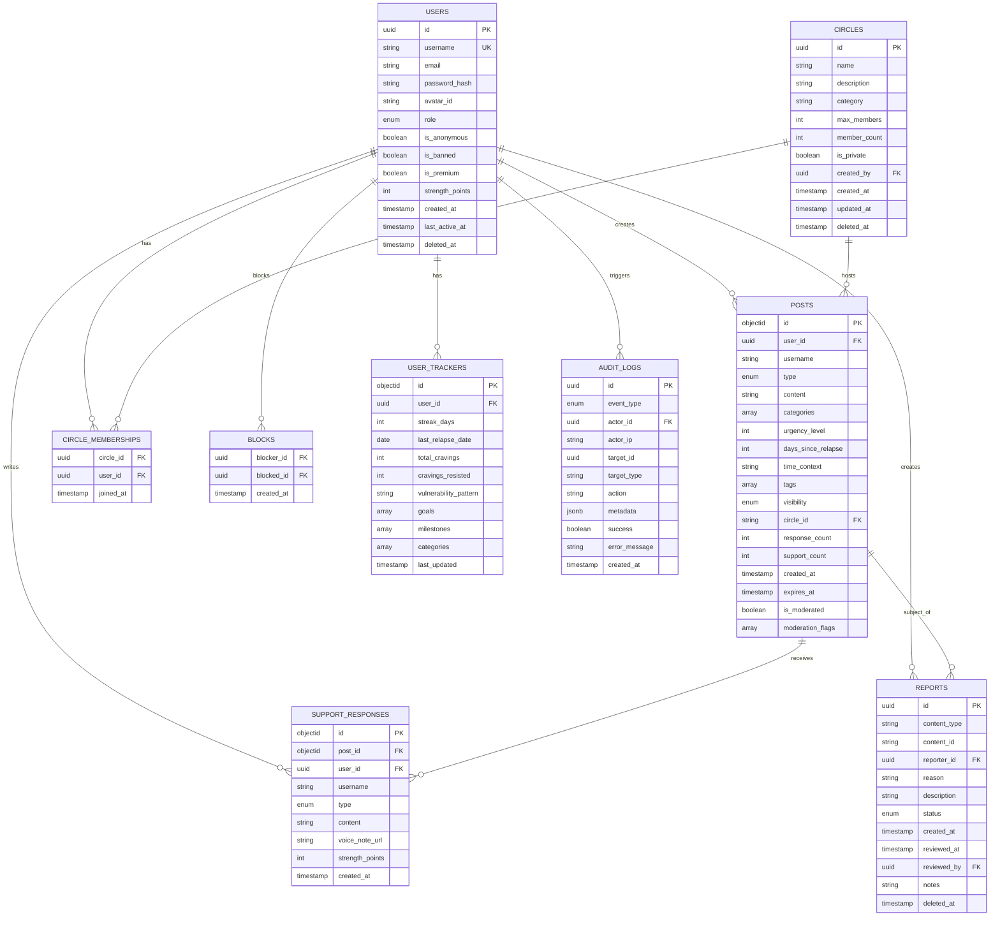

# Data Model

## Entity Relationship Diagram

## PostgreSQL Tables

### Users
Core user accounts and authentication.

**Columns:**
- `id` (UUID, PK): Unique user identifier
- `username` (VARCHAR, UNIQUE): Display name
- `email` (VARCHAR): Encrypted email address
- `password_hash` (VARCHAR): bcrypt password hash
- `avatar_id` (VARCHAR): Avatar identifier
- `role` (VARCHAR): User role (user, moderator, admin)
- `is_anonymous` (BOOLEAN): Anonymous account flag
- `is_banned` (BOOLEAN): Ban status
- `is_premium` (BOOLEAN): Premium membership flag
- `strength_points` (INTEGER): Gamification points
- `created_at` (TIMESTAMP): Account creation
- `last_active_at` (TIMESTAMP): Last activity
- `deleted_at` (TIMESTAMP): Soft delete timestamp

**Indexes:**
- `idx_users_username` on `username`
- `idx_users_email` on `email`
- `idx_users_created_at` on `created_at`
- `idx_users_deleted_at` on `deleted_at` WHERE `deleted_at IS NOT NULL`

### Circles
Support communities and groups.

**Columns:**
- `id` (UUID, PK): Unique circle identifier
- `name` (VARCHAR): Circle name
- `description` (TEXT): Circle description
- `category` (VARCHAR): Topic category
- `max_members` (INTEGER): Maximum member limit
- `member_count` (INTEGER): Current member count
- `is_private` (BOOLEAN): Privacy flag
- `created_by` (UUID, FK): Creator user ID
- `created_at` (TIMESTAMP): Creation time
- `updated_at` (TIMESTAMP): Last update
- `deleted_at` (TIMESTAMP): Soft delete timestamp

**Indexes:**
- `idx_circles_category` on `category`
- `idx_circles_created_at` on `created_at`
- `idx_circles_deleted_at` on `deleted_at` WHERE `deleted_at IS NOT NULL`

### Circle Memberships
Many-to-many relationship between users and circles.

**Columns:**
- `circle_id` (UUID, FK): Circle reference
- `user_id` (UUID, FK): User reference
- `joined_at` (TIMESTAMP): Join timestamp

**Indexes:**
- `idx_circle_memberships_circle_user` on `(circle_id, user_id)` UNIQUE
- `idx_circle_memberships_user` on `user_id`

### Reports
Content moderation reports.

**Columns:**
- `id` (UUID, PK): Report identifier
- `content_type` (VARCHAR): Type of reported content
- `content_id` (VARCHAR): Content identifier
- `reporter_id` (UUID, FK): Reporting user
- `reason` (VARCHAR): Report reason
- `description` (TEXT): Detailed description
- `status` (VARCHAR): Review status (pending, reviewed, dismissed)
- `created_at` (TIMESTAMP): Report time
- `reviewed_at` (TIMESTAMP): Review time
- `reviewed_by` (UUID, FK): Reviewing moderator
- `notes` (TEXT): Moderator notes
- `deleted_at` (TIMESTAMP): Soft delete timestamp

**Indexes:**
- `idx_reports_status` on `status`
- `idx_reports_created_at` on `created_at`

### Blocks
User blocking relationships.

**Columns:**
- `blocker_id` (UUID, FK): Blocking user
- `blocked_id` (UUID, FK): Blocked user
- `created_at` (TIMESTAMP): Block time

**Indexes:**
- `idx_blocks_blocker_blocked` on `(blocker_id, blocked_id)` UNIQUE
- `idx_blocks_blocked` on `blocked_id`

### Audit Logs
Security and compliance audit trail.

**Columns:**
- `id` (UUID, PK): Log entry identifier
- `event_type` (VARCHAR): Event type (auth.login, user.created, etc.)
- `actor_id` (UUID, FK): User who performed action
- `actor_ip` (VARCHAR): IP address
- `target_id` (UUID): Affected resource ID
- `target_type` (VARCHAR): Affected resource type
- `action` (TEXT): Human-readable action
- `metadata` (JSONB): Additional context
- `success` (BOOLEAN): Success flag
- `error_message` (TEXT): Error details if failed
- `created_at` (TIMESTAMP): Event time

**Indexes:**
- `idx_audit_logs_event_type` on `event_type`
- `idx_audit_logs_actor_id` on `actor_id`
- `idx_audit_logs_created_at` on `created_at DESC`
- `idx_audit_logs_success` on `success` WHERE `success = false`

## MongoDB Collections

### Posts
User-generated content posts.

**Fields:**
- `_id` (ObjectID): Post identifier
- `user_id` (UUID): Author user ID
- `username` (String): Author display name
- `type` (Enum): SOS, CheckIn, Victory, Question
- `content` (String): Post text (max 5000 chars)
- `categories` (Array): Topic tags
- `urgency_level` (Integer): 1-5 urgency scale
- `context.days_since_relapse` (Integer)
- `context.time_context` (String)
- `context.tags` (Array)
- `visibility` (Enum): public, private
- `circle_id` (String): Optional circle ID
- `response_count` (Integer): Response counter
- `support_count` (Integer): Support counter
- `created_at` (Date): Creation timestamp
- `expires_at` (Date): Expiration (30 days default)
- `is_moderated` (Boolean): Moderation flag
- `moderation_flags` (Array): Violation tags

**Indexes:**
- `user_id_1` on `user_id`
- `created_at_-1` on `created_at` (descending)
- `type_1` on `type`
- `categories_1` on `categories`
- `circle_id_1` on `circle_id`
- `is_moderated_1` on `is_moderated`
- `created_at_-1_urgency_level_-1` compound for feed
- `expires_at_1` TTL index for auto-deletion

### Support Responses
Responses to posts.

**Fields:**
- `_id` (ObjectID): Response identifier
- `post_id` (ObjectID): Parent post
- `user_id` (UUID): Responder user ID
- `username` (String): Responder name
- `type` (Enum): Quick, Text, Voice
- `content` (String): Response text (max 2000 chars)
- `voice_note_url` (String): Audio URL
- `strength_points` (Integer): Points awarded
- `created_at` (Date): Response timestamp

**Indexes:**
- `post_id_1` on `post_id`
- `user_id_1` on `user_id`
- `created_at_-1` on `created_at`
- `post_id_1_created_at_-1` compound for post responses

### User Trackers
Recovery tracking and analytics.

**Fields:**
- `_id` (ObjectID): Tracker identifier
- `user_id` (UUID): User reference (unique)
- `streak_days` (Integer): Current streak
- `last_relapse_date` (Date): Last relapse
- `total_cravings` (Integer): Total cravings logged
- `cravings_resisted` (Integer): Cravings resisted
- `vulnerability_pattern` (String): Pattern analysis
- `goals` (Array): User goals
- `milestones` (Array): Achieved milestones
- `categories` (Array): User interests
- `last_updated` (Date): Last update

**Indexes:**
- `user_id_1` UNIQUE on `user_id`
- `last_updated_-1` on `last_updated`

## Redis Data Structures

### Sessions
**Key Pattern:** `user:session:{userID}`
**Type:** STRING
**Value:** Refresh token
**TTL:** 7 days

### User Online Status
**Key Pattern:** `user:online:{userID}`
**Type:** STRING
**Value:** "1"
**TTL:** 5 minutes (renewed on activity)

### View Counts
**Key Pattern:** `post:views:{postID}`
**Type:** STRING
**Value:** View count

### Supporters
**Key Pattern:** `post:supporters:{postID}`
**Type:** SET
**Value:** Set of user IDs who sent quick support

### User Feeds
**Key Pattern:** `user:feed:{userID}`
**Type:** SORTED SET
**Value:** Post IDs scored by timestamp

### Refresh Token Rotation
**Key Pattern:** `refresh_token:{userID}:{tokenID}`
**Type:** STRING
**Value:** Token
**TTL:** 7 days

## Data Relationships

- One user can create many posts (1:N)
- One post can have many responses (1:N)
- One user can belong to many circles (N:M via circle_memberships)
- One user can create many reports (1:N)
- Users can block each other (N:M via blocks)
- One user has one tracker (1:1)
- All actions create audit logs (1:N)

## Data Retention

- **Posts**: Auto-deleted after 30 days (TTL index)
- **Audit Logs**: Retained indefinitely (compliance)
- **Sessions**: 7 day TTL
- **Soft Deleted Records**: Retained for 90 days, then hard deleted
